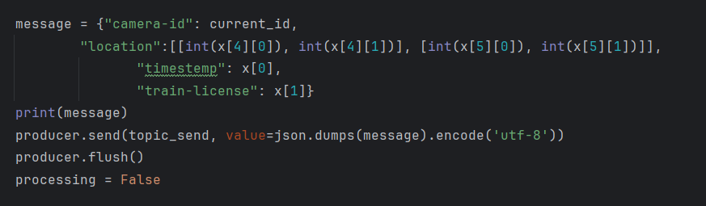
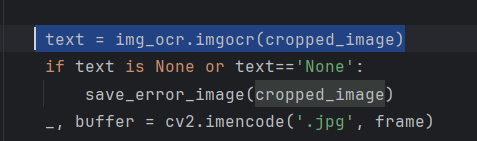

# 滁宁车牌识别程序

## 1.权重下载

下载权重：chepaibest.pt，放到根目录

下载地址：https://gist.github.com/ppsohandsome/48c0c6bd7fb9843078bea766e94dd1f1

## 2.目录

整体程序基于yolov7，下面只介绍新增内容

### 2.1config.py

配置文件，放相机的rtsp和cameraid（有点屎山...）

但是能用

### 2.2run_rtsp_ocr.py

程序主入口


包含kafka配置


权重地址配置


kafka message 格式配置



其余主要是重启及进程管理的逻辑

最重要的一行如下（ocr单帧处理，对应到hubconfwcp_copy.py）：


### 2.3hubconfwcp_copy.py

此文件通过yolov7原始的hubconf.py改变而来


重点方法：

```
def process_frame(model, frame):
```

此方法调用chepaibest.pt检测出车牌位置

随后调用crop_image_by_center截出车牌区域


将截区的车牌进入easyocr进行字符识别



最终return回run_rtsp_ocr.py

```python
return timestemp, text, 1 ,has_train, top_left,bottom_right

timestemp   ----时间
text        ----ocr出来的数字
1           ----无意义，屎山
has_train	----是否有车，true/false
top_left    ----左上角坐标
bottom_right----右下角坐标
```

### 2.4img_ocr.py

在hubconfwcp_copy.py中被调用

识别字符，并经行正则表达式匹配（匹配以0开头的连续三个数字）

## 3.pip包下载

目录里包含requirement.txt，但是请不要直接下载所有的包

因为这个环境与轮廓提取共用，有些包是没有必要的

建议运行run_rtsp_ocr.py，然后缺啥补啥

